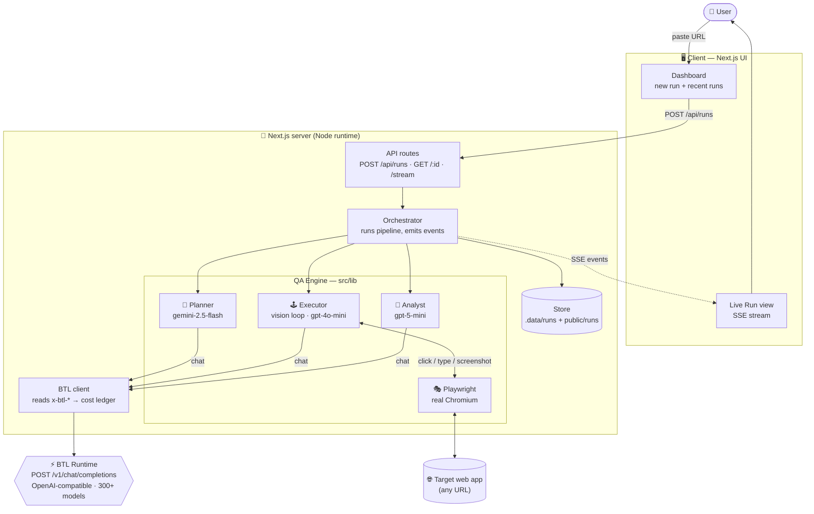
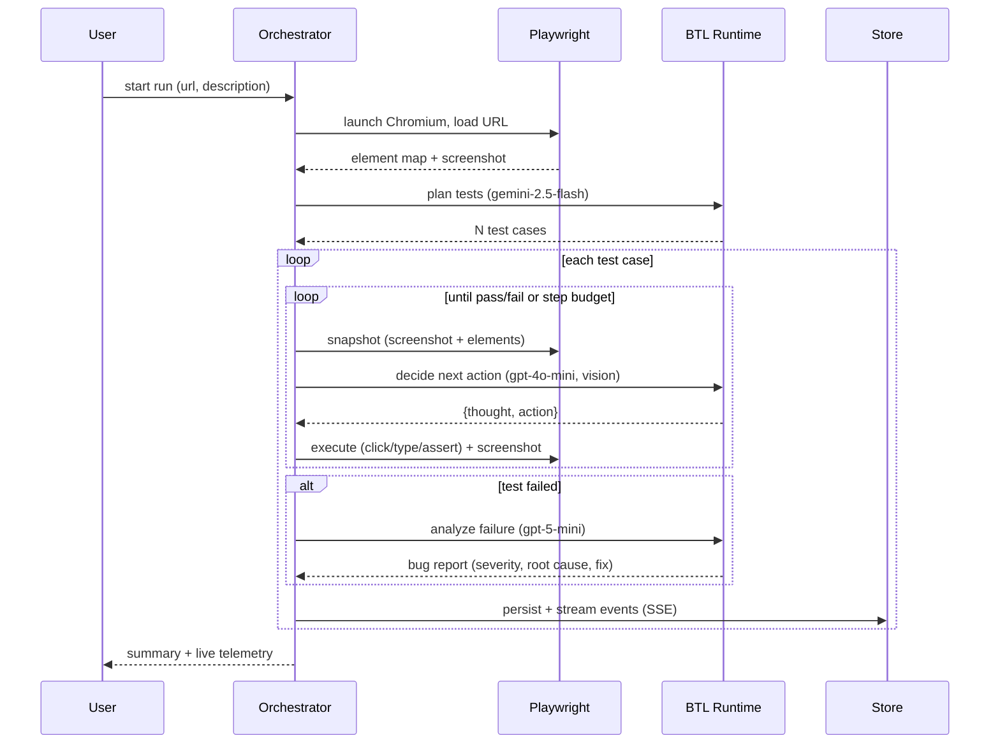

# Verifi — Autonomous AI QA, powered by the BTL Runtime

**Point Verifi at any web app URL. An AI agent opens it in a real browser, writes
end-to-end test cases, executes them like a human, and files developer-ready bug
reports — with screenshots, root cause, and a suggested fix.**

Every reasoning step runs through the **BTL runtime** (`/v1/chat/completions`,
OpenAI-compatible). Verifi is a live showcase of what BTL is *for*: one API key,
one endpoint, hundreds of models — route each job to the cheapest capable model
and watch the real cost accrue from BTL's response headers.

Built for the **BTL Runtime Hackathon** (Jul 3–5, 2026). Inspired by TestSprite
and tester.army — rebuilt on the BTL runtime.

Beyond what's on screen, Verifi captures **console errors and failed network
requests** live from the real browser and feeds them into failure analysis — so
root causes cite the actual JS error or 404, not just the visible symptom.

## Two testing modes

| Mode | Target | How it runs | Deployable |
|------|--------|-------------|------------|
| **Web UI** | any web app URL | LLM-driven Playwright browser agent (vision loop) | long-lived Node host |
| **API** | REST base URL and/or OpenAPI/Swagger spec | LLM plans requests → deterministic HTTP runner sends + asserts | **serverless-friendly** (no browser) |

**API mode** parses an OpenAPI/Swagger spec (or works from a plain description),
has the planner design happy-path, negative, edge, and **multi-call chained**
tests (extract a token/id from one response, use it in the next), then a
deterministic HTTP runner executes them and validates status codes, JSON schema
(key/type/value assertions), and latency. Failures become the same structured bug
reports. Because execution makes **zero LLM calls** (only plan + analyze hit the
runtime), API runs are far cheaper than UI runs — and, with no browser, this mode
runs on serverless/Vercel.

---

## Architecture



### Run pipeline



---

## How the BTL runtime is used

> **Endpoint:** `POST /v1/chat/completions` (OpenAI-compatible) at
> `https://api.badtheorylabs.com/v1`

Verifi's entire brain is the BTL runtime — planning, every browser decision, and
failure analysis are all BTL calls. Three things make the integration
interesting:

### 1. Multi-provider model routing through a single key
Each QA stage is routed to the model that fits it best, across **different
providers**, with no code changes — just env config:

| Stage | Model | Provider | Why |
|-------|-------|----------|-----|
| Planning | `gemini-2.5-flash` | Google | fast, cheap, great at structured JSON test plans |
| Browser agent *(high volume, ~15–20 calls/run)* | `gpt-4o-mini` | OpenAI | cheap **vision** model — the workhorse of the loop |
| Failure analysis | `gpt-5-mini` | OpenAI | frontier reasoning, only where it matters |

The BTL value prop in miniature: **cheap model for the volume, frontier model for
the hard reasoning — one key, one endpoint, many providers.**

### 2. Live cost telemetry from BTL's proprietary headers
Every call reads BTL's response headers and folds them into a per-run ledger,
surfaced live in the UI:

| Header | Shown as |
|--------|----------|
| `x-btl-customer-charge` | **Runtime spend** |
| `x-btl-benchmark-cost` | **Benchmark reference** |
| `x-btl-saved` | **Saved on reruns** (exact-cache) |
| `x-btl-cache-tier` | **cache hits** |

A QA tool makes *hundreds* of LLM calls per run — Verifi turns BTL's per-call
economics into a first-class dashboard so you always see what a test run costs.

### 3. Graceful catalog compatibility
BTL exposes 300+ models with differing capabilities. The client requests
`response_format: json_object` and **automatically retries without it** for models
that don't support JSON mode, then parses defensively — so any model in the
catalog can be dropped into any stage.

See `src/lib/btl.ts` (client + header capture) and `src/lib/models.ts` (routing).

---

## Project structure

```
src/
├─ app/
│  ├─ page.tsx ................ dashboard (new run + recent runs)
│  ├─ run/[id]/ ............... live run view (SSE)
│  └─ api/runs/ ............... POST start · GET [id] · [id]/stream (SSE)
├─ components/ ................ CostPanel · TestCard · EventLog · NewRunForm · RunsList
└─ lib/
   ├─ btl.ts .................. BTL runtime client + cost ledger from x-btl-* headers
   ├─ models.ts .............. per-stage model routing
   ├─ store.ts ............... in-memory + JSON persistence + SSE pub/sub
   ├─ types.ts ............... domain types
   └─ agent/
      ├─ browser.ts .......... Playwright driver, element map, screenshots
      ├─ planner.ts .......... generates test cases          (BTL)
      ├─ executor.ts ......... agentic vision browser loop    (BTL)
      ├─ analyst.ts .......... failure → structured bug report (BTL)
      └─ orchestrator.ts ..... runs the pipeline, emits streaming events
```

Runs and screenshots persist to `.data/runs/*.json` and `public/runs/<id>/`.

---

## Run it locally

Requires Node 18+ (built on 22) and ~90 MB for the Playwright Chromium download.

```bash
npm install            # also downloads Chromium via postinstall
# create .env (see below) with your BTL key
npm run dev            # http://localhost:3000
```

Paste a URL (try `https://demo.playwright.dev/todomvc`) and hit **Run QA**.

### `.env`
```
BTL_API_KEY=gw_...                          # your BTL key
BTL_BASE_URL=https://api.badtheorylabs.com/v1
VERIFI_PLANNER_MODEL=gemini-2.5-flash
VERIFI_AGENT_MODEL=gpt-4o-mini
VERIFI_ANALYST_MODEL=gpt-5-mini-2025-08-07
```
Swap any stage to any of BTL's 300+ models — the routing panel updates itself.

---

## Tech stack

Next.js 15 (App Router) · TypeScript · Tailwind v4 · Playwright (Chromium) ·
Server-Sent Events · BTL runtime (OpenAI-compatible).

---

## Submission

- **What we built:** an autonomous AI QA web app that explores any site in a real
  browser, writes & runs end-to-end tests, and files bug reports — with all AI
  reasoning on the BTL runtime.
- **BTL endpoint used:** `POST /v1/chat/completions` (OpenAI-compatible), across
  `gemini-2.5-flash`, `gpt-4o-mini`, and `gpt-5-mini` via a single BTL key, with
  live cost telemetry from the `x-btl-*` response headers.
- **Team:** _<your team name & members>_

You keep full ownership of whatever you build. 🖤
